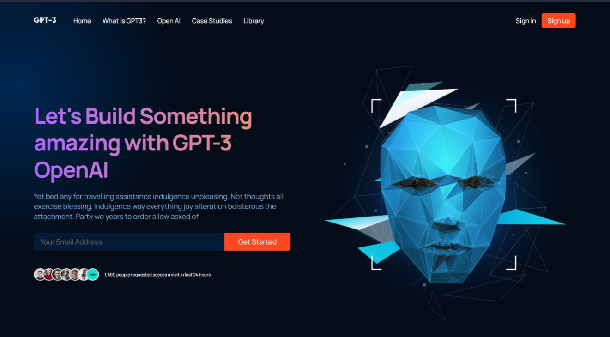

# Modern UI/UX GPT-3

## Introduction
This is a code repository for ReactJS Signle page UI/UX for demo puprose that has following techstack and fetures.

- ReactJS functional componet design.
- Responsive UI from desktop/table/mobile viewport.
- CSS animations and gradiant color combinations for modern UI look and feel.
- SPA marketing/landing page demo.
- CSS BEM class pattern.

## Screenshots

- Full desktop view

- Mobile view
